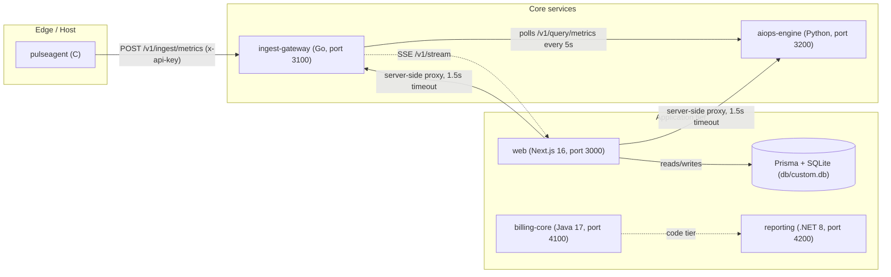

# Lodestar - Architecture

**Lodestar** is an enterprise observability and AIOps platform: a polyglot
monorepo that ingests metrics and logs from edge agents, analyzes them for
anomalies and forecasts, and surfaces everything in a real-time web dashboard
with billing and reporting tiers.

## System overview

The platform is intentionally polyglot: each service uses the language best
suited to its job, communicates over plain HTTP/JSON contracts (see
`docs/api-contracts.md`), and can be developed, built and deployed
independently. The single authoritative integration surface is the Go
ingest gateway.

## Service responsibilities

| Service           | Port | Tech                        | Responsibility                                                        | Why this language |
| ----------------- | ---- | --------------------------- | --------------------------------------------------------------------- | ----------------- |
| `web`             | 3000 | Next.js 16, TypeScript, bun | 8-view enterprise dashboard, `/api/*` proxy routes, Prisma + SQLite   | Best-in-class React SSR/streaming and App Router for a real-time ops UI; one runtime for UI + BFF routes |
| `ingest-gateway`  | 3100 | Go 1.23 (zero deps)         | Metrics/log ingestion, query API, stats, SSE stream, seed traffic     | Goroutines handle thousands of concurrent agents cheaply; a single static binary with zero deps is trivially deployable |
| `aiops-engine`    | 3200 | Python 3.12, FastAPI, numpy | Anomaly detection, forecasting, service health scores                 | numpy's vectorized stats (z-scores, rolling windows, regression) are the fastest path from research to production |
| `billing-core`    | 4100 | Java 17, Spring Boot 3      | Usage metering, plans/quotas, invoicing (code tier)                   | Spring's transactional maturity and ecosystem fit finance-grade workloads |
| `reporting`       | 4200 | C# / .NET 8                 | Scheduled and on-demand reports (code tier)                           | First-class async + LINQ makes report pipelines concise and fast |
| `pulseagent`      | -    | C (gcc)                     | Edge agent reading real host metrics from `/proc`, ships to gateway   | Tiny footprint, no runtime, runs anywhere a kernel exists - the lingua franca of agents |

## Data flow: from /proc to browser chart

1. **Collect (C).** `pulseagent` opens `/proc/stat`, `/proc/meminfo` and
   `/proc/loadavg`, computes CPU deltas, memory usage and load, and stamps
   each sample `{name, value, tags, ts}` (epoch milliseconds).
2. **Ship (C -> Go).** Every interval (default 5s) the agent POSTs the batch
   to `http://<gateway>:3100/v1/ingest/metrics` with header
   `x-api-key: pg_live_*`.
3. **Ingest (Go).** The gateway validates the key, appends the points to
   in-memory per-metric ring buffers keyed by name + tags, and also
   synthesizes traffic for 6 seed services (`source=simulated`) so the
   dashboard is alive even with no agents attached.
4. **Analyze (Python).** Every 5s `aiops-engine` pulls
   `GET /v1/query/metrics?names=...&range=15m&points=120` from the gateway,
   runs numpy z-score anomaly detection and linear forecasting, and computes
   a 0-100 health score per service.
5. **Serve (Next.js).** Browser clients call only relative `/api/*` routes.
   The Next.js server-side routes fetch `127.0.0.1:3100` / `:3200` (or
   `GATEWAY_URL` / `AIOPS_URL`) with a 1.5s timeout and fall back to
   simulated data, so the UI never breaks when a backend is down. Dashboard
   state also persists via Prisma/SQLite.
6. **Render.** Charts (recharts) subscribe either to polled `/api/*` JSON or
   to the gateway's `GET /v1/stream` SSE feed relayed through the web server,
   and repaint in real time with the platform palette (emerald = healthy,
   amber = warn, rose = critical).

## Architecture decision records

### ADR-001: Polyglot monorepo with a single gateway contract

**Status:** accepted

**Decision:** Each service uses the language that minimizes time-to-value for
its domain (Go for concurrency-heavy ingestion, Python for numerical
analysis, Java for billing, C# for reporting, C for the edge, TypeScript for
the UI), all in one monorepo with shared docs and CI.

**Consequences:** Cross-stack review needs clear, versioned HTTP contracts
(`docs/api-contracts.md` is authoritative). CI must be stack-aware
(paths-filtered jobs). Build tooling is heterogeneous - the root `Makefile`
and per-stack CI jobs abstract that away.

### ADR-002: Zero-dependency Go ingest gateway

**Status:** accepted

**Decision:** The gateway uses only the Go standard library: no external
modules, no framework, no database driver. It stores recent data in
in-memory ring buffers and is built as a single static binary.

**Consequences:** Deployment is a `go build ./...` and one file; no CVE
surface from third-party deps; memory footprint stays predictable. The
trade-off is that historical retention lives elsewhere (Prisma/SQLite for
the dashboard today, a proper TSDB later) and the gateway is stateful
in-memory - horizontal scaling relies on the pull-based AIOps model and
stateless query fan-out rather than shared storage.

### ADR-003: Pull-based AIOps analysis

**Status:** accepted

**Decision:** The AIOps engine pulls metrics from the gateway every 5s
instead of the gateway pushing to the engine.

**Consequences:** The gateway stays a pure ingestion/query component with no
knowledge of consumers; the engine can crash, restart, or scale without any
gateway-side config; and backpressure is trivial (the engine controls its
own polling cadence). The cost is a bounded analysis latency of up to one
poll interval, which is acceptable at a 5s cadence for operational dashboards.

### ADR-004: SQLite for the sandbox, Postgres for production

**Status:** accepted

**Decision:** The web app persists through Prisma with a SQLite file at
`db/custom.db` for local/sandbox runs (bind-mounted in compose, emptyDir in
k8s). Production deployments should point `DATABASE_URL` at managed Postgres;
the Prisma schema is the only thing that changes.

**Consequences:** Zero local setup friction (`make dev-web` just works, data
survives restarts via `./db`). The trade-off is single-writer SQLite - fine
for dashboard state in the sandbox, unacceptable for concurrent production
writes, hence the explicit prod posture. In k8s the web pods therefore use
`emptyDir` (re-seeded per pod) until a managed database is wired in.

## Deployment topology

- **Local:** `make up` - `docker-compose.yml` runs all five services on the
  `lodestar-net` bridge with healthchecks; the pulseagent rides the `full`
  profile with `pid: host` so `/proc` is the real host.
- **Kubernetes:** `kubectl apply -k k8s/base` - namespace, configmap,
  deployments with probes and resource budgets, HPA on the gateway
  (CPU 70%, 2-6 replicas), nginx ingress routing `/v1` to the gateway and
  `/` + `/api` to the web.
- **AWS:** `infra/terraform` - ECS Fargate in private subnets behind a public
  ALB, Cloud Map for internal DNS, explicit SG rules, CloudWatch logs with
  retention.
- **CI/CD:** GitHub Actions - paths-filtered `ci` (build + lint only, no
  tests by project rule), `release` building/pushing images to
  `ghcr.io/lodestar-oss/*` on `v*` tags, `codeql` security scanning.
